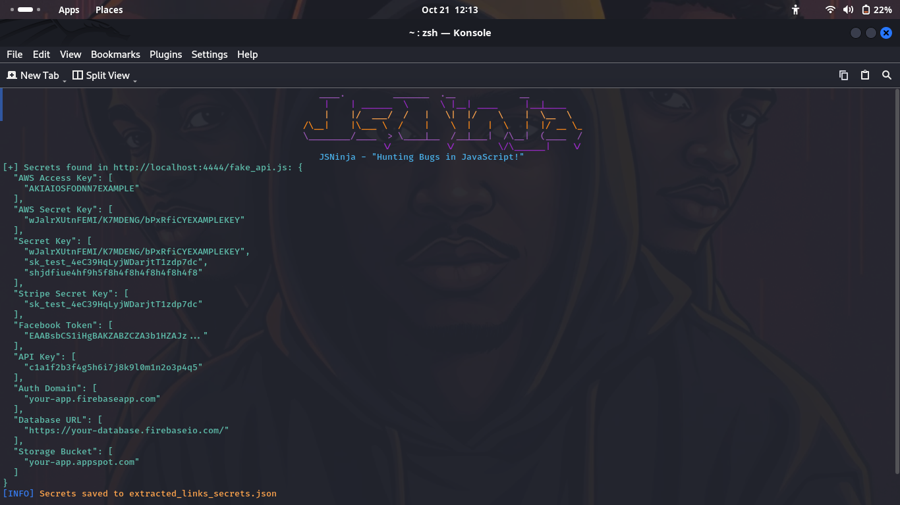

<p align="left">
</p>
<p align="center">
<a href="#"></a>
<a href="https://www.python.org/"></a>
<a href="https://github.com/iamunixtz/JSNinja/stargazers"></a>
<a href="https://github.com/iamunixtz/JSNinja/issues"></a>
</p>


## JSNinja - "Hunting Bugs in JavaScript!"

JSNinja is a powerful tool for extracting URLs and sensitive information from JavaScript files. It's designed for security enthusiasts,BugHunters and developers.

<p align="center">

</p>

### Installation:

To install JSNinja, run the following commands:

```bash
apt update
apt install git python3 python3-pip -y
git clone https://github.com/iamunixtz/JSNinja.git
cd JSNinja
pip3 install -r requirements.txt
```

### Single Command:

```bash
apt update ; apt install git python3 python3-pip -y ; git clone https://github.com/iamunixtz/JSNinja.git ; cd JSNinja ; pip3 install -r requirements.txt
```

<br>

## Usage:

To run JSNinja, use the following command:

```bash
python3 jsninja.py -u http://example.com/script.js --secrets --urls
```

### Command-Line Options:
- `-u` or `--url`: Specify a single JavaScript URL to fetch.
- `--secrets`: Look for sensitive information in the JavaScript content.
- `--urls`: Extract URLs from the JavaScript content.
- `-o` or `--output_file`: Specify the file to save extracted links (default: `extracted_links.txt`).

## Features:
#### [+] Extract URLs from JavaScript files!
#### [+] Identify sensitive information such as API keys and tokens!
#### [+] User-friendly interface!
#### [+] Open Source and actively maintained!

## Credits:
#### > [Iamunixtz](https://github.com/iamunixtz)
#### > Inspired by various open-source projects!


## License:
This project is licensed under the MIT License - see the [LICENSE](LICENSE) file for details.
